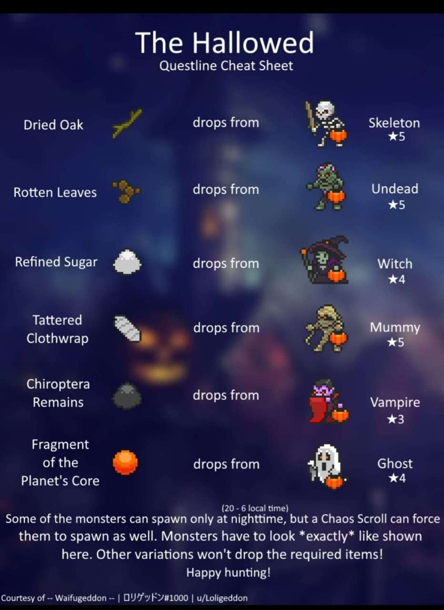

# The Hallowed!

> Last Update: 29 Oct, 2023

## SzHb's Notes
1. 7 Quests.
2. Get ***T10*** Aglovale from quest. Need 5 ***T10*** Old Hallowed Blade from Arisen Pumpkinhead for the quest.
3. Get some hallowed candle(5% xp boost) from (Arisen) Pumpkinhead for Exp farming.
4. Get some Small Bestial Potions(5% follower act), Ichor and Great Monster Remains from ***T4*** Pumpkin Spider.
5. Get ***T9*** Onryo pet, which can cause Def↓↓, Res↓↓ and Confused.
6. Get ***T8*** Very Scary Skeleton skill, which can cause t.Def↓↓ and t.Res↓↓.
7. Get high quality Arisen Pumpkinless Armor and Leggings if you need, which can increase two-handed damage. 

## Event Checklist (mostly from Discord)

### Followers
- ***T6*** Scarecrow
- ***T8*** Pumpkinhead
- ***T9*** Onryo

### Raids ([K]-Kingdom raid, [W]-Summoning scroll, [O]-Others)

(Arisen) Pumpkinless is summoned by (Arisen) Hallowed Summoning Scroll, which can be crafted in Herbalist.

- **[K]** ***T4*** Pumpkin Spider
- **[K/W]** ***T8*** Pumpkinhead
- **[O]** ***T8*** Pumpkinless
- **[K/W]** ***T10*** Arisen Pumpkinhead
- **[O]** ***T10*** Arisen Pumpkinless

### Monsters
- ***T3*** Vampire
- ***T4*** Ghost
- ***T4*** Witch
- ***T5*** Mummy
- ***T5*** Skeleton
- ***T5*** Undead
- ***T8*** Pumpkin Spider
- ***T10*** Scarecrow

### Skills
- ***T8*** Onryo
- ***T8*** Very Scary Skeleton
- ***T9*** Hati
- ***T9*** Spooky Ghost
- ***T10*** Scarecrow

### Questline

Talk to Feralia in the world to start questline.

- Quest 1: Dried Oak(1)
- Quest 2: Rotten Leaves(1)
- Quest 3: Refined Sugar(1)
- Quest 4: Tattered Clothwrap(1)
- Quest 5: Chiroptera Remains(1)
- Quest 6: Fragment of the Planet's Core(1)
  - Reward: Hallowed Blade
- Quest 7: Hallowed Blade(1) + Old Hallowed Blade(5)
  - Reward: Aglovale

Each of the quest monsters has a little pumpkin pail. You'll find them in the world. See a helpful mob-to-item visual here, courtesy of Waifugeddon:

---

*Remark:*

*Event mobs too rare. Just give up the pumpkinless if you don't have much time for world mobs farming.*

*by SzHb*